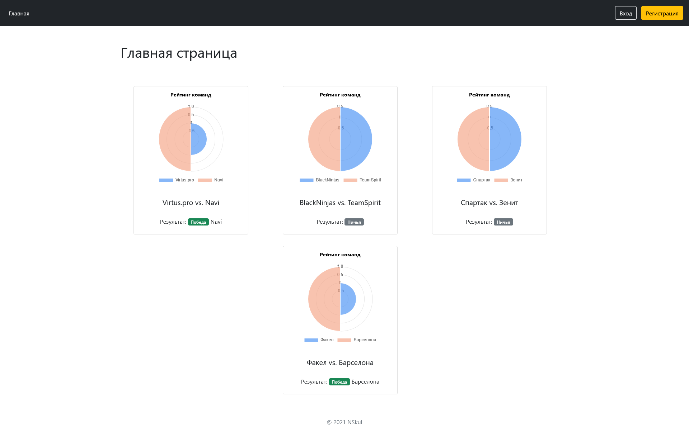
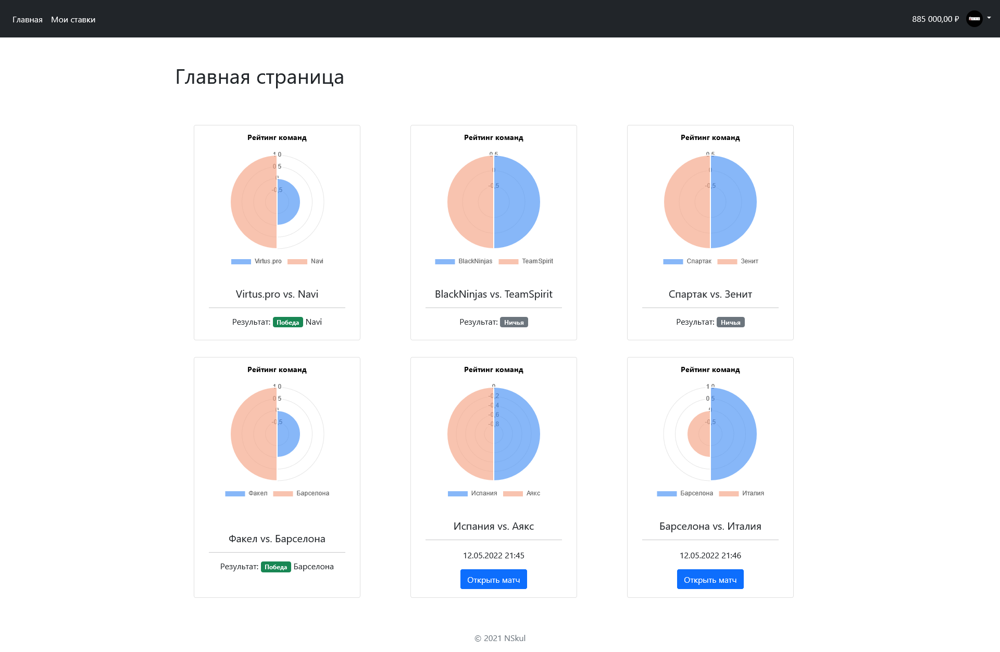
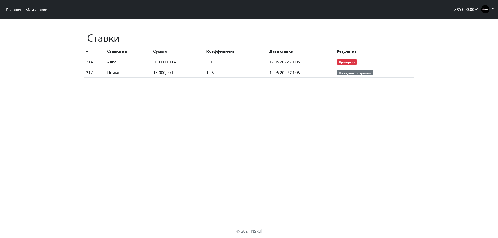
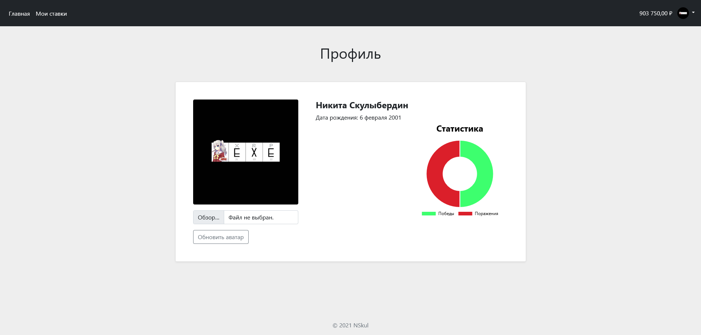

# Проект "Прием ставок на спортивные события"
Цель проекта освоить принципы создания web-сервисов на основе Spring Boot 
и его основных компонентов. Для обеспечения базовай работы с базой данных PostgreSQL (Spring Data).
Для обеспечения защиты компонентов приложения (Spring Security).
## Основные технологии
- Spring (Boot, Security, Data)
- JPA/Hibernate
- PostgreSQL 
- Thymeleaf

## Запуск
### База данных
Запустить БД PostgreSQL вручную.

Или c помощью Docker:
```docker
docker run --name bet-bd -p 5432:5432 -e POSTGRES_DB=nsbet -e POSTGRES_PASSWORD=root -d postgres
```
### Запуск сервера
1. Запустить `nsbet-0.0.1-SNAPSHOT.jar`. 
2. Открыть в браузере `localhost:8081`
### Пользователь 
Стандартный пользователь с правам администратора.
```
  login: nikita
  password: nikita
```
## Скриншоты






